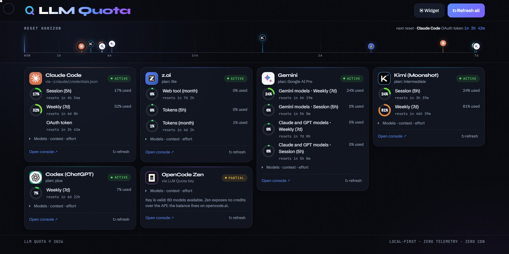

<div align="center">

# LLM Quota

**One live dashboard for every AI subscription you pay for.**

Claude Code · Codex · Gemini · z.ai · Moonshot — quotas, reset times, and local token spend.
Runs on your machine. Talks to nobody but the providers.

[](LICENSE)
[](https://github.com/SandroHub013/llm-quota/actions/workflows/ci.yml)
[](https://bun.sh)
[](CONTRIBUTING.md)
[](https://github.com/SandroHub013/llm-quota/stargazers)

**[→ llm-quota website](https://sandrohub013.github.io/llm-quota/)**

[Quickstart](#quickstart) · [Personalization](#your-installation-your-data) · [Providers](#supported-providers) · [CLI](#cli-for-terminals-and-ai-agents) · [Privacy](#privacy) · [Contributing](CONTRIBUTING.md) · [🇮🇹 Italian](README.it.md)



</div>

---

## The problem

You pay for four or five AI subscriptions. Each one rate-limits you differently, in a different
console, on a different clock. Claude Code has a 5-hour window *and* a weekly cap. Codex has its
own. Gemini counts per model. The moment you actually hit a limit, the only question that matters
is the one no percentage bar answers:

> **When am I back?**

LLM Quota puts every reset from every provider on one horizon — now → 7 days — so you can see at a
glance which subscription is free, which is cooling down, and exactly when to come back.

## Features

- ⏳ **Reset horizon** — every currently measurable provider reset on one time axis. Hover a marker, its card
  lights up; hover a card, its marker lights up.
- ⚡ **Live without reloads** — quotas refresh silently every minute, local spend every five seconds,
  and reset countdowns keep moving between requests. Unchanged data does not repaint the interface.
- 🔑 **Official-surface first** — Codex is queried through `codex app-server`; Claude Code and
  Antigravity deliberately deliver quota JSON through opt-in local status-line bridges. LLM Quota
  never reads or refreshes another client's OAuth token.
- 💶 **Local token ledger** — totals Codex, Claude Code, OpenCode and Kimi Code history by
  model, effort and main/subagent, with an estimated API-equivalent value in euros and a
  context-reuse efficiency index. A GitHub-style daily calendar shows when those tokens and euros
  were spent; its optional GitHub view always uses the locally authenticated `gh` account.
- 🔒 **Local-first** — no cloud, no database, no account. Keys and tokens never leave the machine.
- 🚫 **Zero third-party requests** — fonts and provider logos ship in `public/`. The page loads
  nothing from a CDN, a font host, or a favicon service. [Enforced by a test.](src/frontend.test.ts)
- 🤖 **CLI built for AI agents** — `llm-quota status --json` gives sanitized JSON and meaningful
  exit codes, so an agent can check its own budget before starting a long job.
- 🪟 **Windows desktop widget** — a floating always-on-top Tk widget, launched from the dashboard
  via the `llmquota://widget` protocol. It silently refreshes quotas every minute, local spend
  every five seconds, and keeps reset countdowns moving between requests. It shows the five provider
  cards; OpenCode remains included only in local spend.
- ♿ **Accessible** — full keyboard navigation, `prefers-reduced-motion` respected, all primary
  providers on screen without scrolling from 1280×800 up.

---

## Quickstart

**Requires [Bun](https://bun.sh) 1.0+.** (The server uses `Bun.serve`; Node is not supported.)
Python 3 is optional, and only for the Windows widget.

```bash
git clone https://github.com/SandroHub013/llm-quota.git
cd llm-quota
bun install
bun start          # → http://localhost:4747
```

That is the whole setup. Codex populates through its official app-server. On the Claude and Gemini
cards, choose **Enable official bridge** once if you want their official clients to publish quota to
LLM Quota. Existing CLI histories populate the local token ledger automatically.

<details>
<summary>One-liner install</summary>

macOS / Linux:
```bash
git clone https://github.com/SandroHub013/llm-quota.git && cd llm-quota && bun install && bun start
```

Windows (PowerShell):
```powershell
git clone https://github.com/SandroHub013/llm-quota.git; cd llm-quota; bun install; bun start
```
</details>

<details>
<summary>Install the CLI globally</summary>

```bash
bun add -g github:SandroHub013/llm-quota
llm-quota status
```
Both `llm-quota` and `webquota` are registered as commands.
</details>

<details>
<summary>Other options</summary>

```bash
bun run dev            # hot reload
PORT=8080 bun start    # custom port on macOS / Linux
```

```powershell
$env:PORT=8080; bun start    # custom port on Windows
```
</details>

---

## Your installation, your data

No runtime account, username, quota, or spend total is tied to the project author:

- Codex authentication remains inside `codex app-server`; LLM Quota never opens Codex's auth file.
- Opt-in Claude/Antigravity bridges cache only quota windows and reset times. They exclude account
  identity, transcripts and access tokens, and preserve an existing custom status line.
- The token ledger scans the current user's local Codex, Claude Code, OpenCode, and Kimi Code history.
- The optional contribution calendar queries the viewer authenticated by the official GitHub CLI.
  Run `gh auth login` to enable it; without `gh`, the local spend calendar continues to work.
- A dashboard running on a custom local port passes its own origin to the Windows widget automatically.
  The CLI and a manually launched widget also accept `LLM_QUOTA_URL`; the widget additionally accepts
  `--server-url`.

Screenshots and social previews use synthetic sample data. They contain no maintainer account,
credentials, or real usage history.

---

## Supported providers

| Provider | Supported source | What you get |
|---|---|---|
| **Claude Code** | Official status-line JSON (opt-in) | 5h + weekly quota %, reset time and source freshness |
| **Codex** (ChatGPT) | Official `codex app-server` JSON-RPC | Active plan + usage windows |
| **z.ai** | Official Usage Query plugin / console | Honest unavailable state until a public dashboard API exists |
| **Gemini / Antigravity** | Official Antigravity status-line JSON (opt-in) | Per-bucket remaining quota and reset time |
| **Kimi / Moonshot** | Documented Open Platform balance API | API credit; Kimi Code subscription quota remains in `/usage` |

OpenCode remains a source for the local token ledger, but Zen is intentionally omitted from the
quota cards: its public endpoint exposes a model catalog, not numeric usage, limits or reset times.

Keys you paste yourself are stored locally in `~/.llm-quota/config.json`. They are never sent
anywhere except to the provider they belong to, and never committed.

**Want another provider?** Add an adapter in `src/providers/` implementing the `Provider`
interface and register it in `src/providers/index.ts`. That is the whole contract — see
[CONTRIBUTING.md](CONTRIBUTING.md).

---

## CLI for terminals and AI agents

With the server running:

```bash
bun run cli status            # compact text summary
bun run cli status --json     # sanitized JSON, safe to paste into a prompt
bun run cli provider codex    # one provider only
bun run cli doctor            # health check
```

Exit codes make it scriptable — and let an agent decide for itself whether to start a job:

| Code | Meaning |
|---|---|
| `0` | Healthy, quota available |
| `1` | Warning — at least one quota ≤ 20% |
| `2` | Auth error or provider unreachable |
| `3` | Server offline or bad arguments |

Point it at another host or port with `LLM_QUOTA_URL=http://localhost:8080`.

---

## Windows desktop widget

```bash
python widget.py --register-protocol
```

Registers `llmquota://widget`. The **Widget** button in the dashboard then launches a floating
Tk widget on the desktop and passes the dashboard's local origin automatically. For a manual or
remote setup:

```powershell
python widget.py --server-url http://localhost:8080
python widget.py --register-protocol --server-url http://localhost:8080
```

---

## Privacy

This is the point of the project, so it is worth being precise:

- No telemetry, no analytics, no crash reporting. There is no server to report *to*.
- The frontend makes **zero** third-party requests. Fonts (Syne, Schibsted Grotesk, JetBrains
  Mono — ~102 KB, latin subset) and provider logos are served from `public/`.
  A [test](src/frontend.test.ts) fails the build if any external host creeps back in.
- Provider logos are frozen in the repo deliberately: loading them from the provider — or from a
  favicon service, as an earlier version did — would tell a third party which AI subscriptions
  you hold, on every page load.
- OAuth credential files belonging to Codex, Claude, Gemini, OpenCode and Kimi are not read or
  modified. User-supplied Open Platform keys are used only with their documented provider API.

---

## Architecture

```text
src/
├── server.ts          # loopback-only Hono backend (/api/quota, /api/key, /api/official-bridge)
├── codex-app-server.ts# official Codex JSON-RPC client
├── official-bridge.ts # opt-in Claude/Antigravity status-line wrappers
├── credentials.ts     # user-supplied key config only
├── cli.ts             # CLI for developers and agents
└── providers/         # one adapter per provider (fetch → QuotaResult)
public/                # frontend SPA — HTML, CSS, vanilla JS, no build step
├── fonts/             # self-hosted variable fonts (woff2, latin subset)
└── logos/             # official provider marks, frozen
widget.py              # Windows Tkinter desktop widget
```

Stack: [Bun](https://bun.sh) + [Hono](https://hono.dev) + TypeScript. One runtime dependency.
No bundler, no framework, no build step for the frontend.

```bash
bun test          # 31 tests
bun run typecheck
```

---

## Contributing

New provider adapters, bug reports and UI fixes are all welcome — start with
[CONTRIBUTING.md](CONTRIBUTING.md). Good first issues are tagged
[`good first issue`](https://github.com/SandroHub013/llm-quota/labels/good%20first%20issue).

The dashboard, the CLI and the desktop widget are all in English. There is no i18n layer
yet — if you want the UI in another language, that is an open design question worth an
issue before a PR.

## License

[MIT](LICENSE). Free for personal and commercial use.

### Trademarks

The MIT license covers this project's code, not other people's marks. The logos in
`public/logos/` belong to their respective owners (Anthropic, OpenAI, Z.ai, OpenCode, Google,
Moonshot AI) and are included only to identify the service each card refers to. This project is
not affiliated with, endorsed by, or sponsored by any of them.

---

<div align="center">

If this saved you a trip to five different billing consoles, **[⭐ star the repo](https://github.com/SandroHub013/llm-quota)** — it is how other people find it.

</div>
